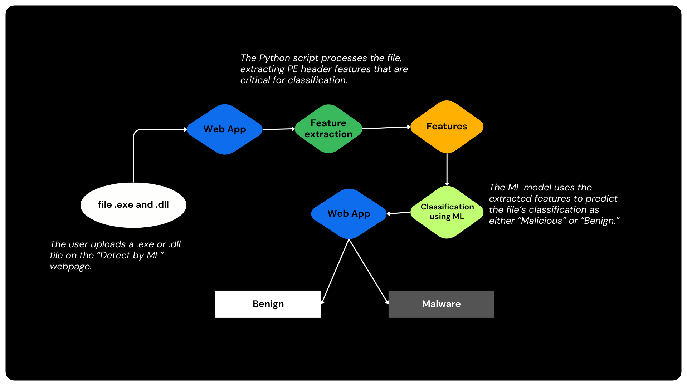

# ML-Based Malware Detection

- [Machine Learning-Based Detection](#machine-learning-based-detection)
- [Technologies Used by ML](#technologies-used-by-ml)
- [Feature Selection and Model Training](#feature-selection-and-model-training)
- [File Types Supported by ML](#file-types-supported-by-ml)
- [DEMO ML](#demo-ml)

The **Machine Learning-Based Detection** component leverages a machine learning model trained to detect malicious behavior in executable files. By focusing on feature extraction from Portable Executable (PE) headers, this tool offers an advanced, ML-powered approach to identify malware within `.exe` and `.dll` files.

---

### Technologies Used by ML

This module uses the following technologies:

- **Python**
- **Scikit-learn**
- **Flask**
- **NumPy**
- **Pandas**
- **Matplotlib**
- **pefile**
- **Joblib**

---

### Feature Selection and Model Training

The model focuses on the most important features extracted from the PE headers of executable files. Here’s an overview of the key processes:

1. **Feature Extraction**: PE header features are extracted from each file to create the feature set.
2. **Feature Selection**: Important features are selected based on importance scores from a Random Forest Classifier. Only the most relevant features are retained to optimize model accuracy.
3. **Model Training**: A Random Forest model is trained on the filtered feature set, allowing it to distinguish between benign and malicious executables with high precision.

**Model Performance**  
| Metric | Precision | Recall | F1-score | Accuracy |
|----------------|-----------|--------|----------|----------|
| **Benign** | 1.00 | 0.97 | 0.98 | 1003 |
| **Malware** | 0.99 | 1.00 | 0.99 | 2920 |
| **Overall** | - | - | - | 99% |

---

### File Types Supported

This feature is specifically designed for the following file types:

- **Executable files**: `.exe`, `.dll`

---

### DEMO ML

Below is a visual walkthrough showing how the **Machine Learning-Based Detection** feature works.

**Upload Page**  
  
_Description: The user selects an executable file for analysis._

**Analysis Results**  
  
_Description: Results of the ML-based detection showing whether the file is benign or malicious._

> **Video Demo**  
> For a detailed walkthrough, watch the video below:  
> 

---

### How It Works

1. **File Upload**: The user uploads an executable file (.exe or .dll) for ML-based analysis.
2. **Feature Extraction**: The system extracts PE header features and selects only the most important features based on prior analysis.
3. **Model Prediction**: The Random Forest model uses the extracted features to predict if the file is benign or malicious.
4. **Result Display**: The application displays the result on a user-friendly interface, including probability scores and model confidence.
   

---

### Benefits of Machine Learning-Based Detection

- **High Precision**: The model achieves high accuracy in detecting malware, minimizing false positives.
- **Automated Feature Selection**: Uses the most relevant features for analysis, improving both speed and accuracy.
- **Focused Detection**: Designed specifically for executables, ensuring optimized and reliable detection for a key threat vector.

This ML-based approach complements the static analysis, providing a comprehensive toolkit for malware detection.

---

**Note**: The accuracy and precision of the model are validated on a balanced dataset, ensuring reliable performance on new and unseen data.

---

## Feature Selection and Model Training

### Selection of Features According to Their Importances

Using a Random Forest Classifier, we evaluated the importance of different features to identify the most significant ones for malware detection. By filtering the features based on their importances, we set a threshold to select only the most relevant features for training our model. This approach enhances the model's efficiency and accuracy.

### Before Selection of Features According to Their Importances

### After Selection of Features According to Their Importances

### Training a New Model Based on Important Features

After selecting the important features, we trained a new model, which yielded the following classification metrics:

| Class        | Precision | Recall | F1-Score | Support  |
| ------------ | --------- | ------ | -------- | -------- |
| Benign       | 1.00      | 0.97   | 0.98     | 1003     |
| Malware      | 0.99      | 1.00   | 0.99     | 2920     |
| **Accuracy** | **0.99**  |        |          | **3923** |
| Macro Avg    | 0.99      | 0.98   | 0.99     | 3923     |
| Weighted Avg | 0.99      | 0.99   | 0.99     | 3923     |

**Training Scores:**  
The average training score is approximately 99.13%.

**Validation Scores:**  
The average validation score is around 98.63%.

The results demonstrate high performance for both training and validation sets, with only a slight discrepancy of 0.51%.

### Analysis

- **No Overfitting:** The close alignment of training and validation scores indicates that the model is likely not overfitting. In cases of significant overfitting, we would expect a higher training score compared to the validation score.
- **Slight Underfitting Possibility:** While the validation score is marginally lower than the training score, indicating a slight potential for underfitting, the difference is minimal.

By analyzing these scores and visualizations, we gain insight into the model's learning behavior and can make informed decisions for further improvements.

## Contributors ✨

<table>
  <tr>
    
<td align="center"><a href="https://github.com/VishalBhat07"> <b>VishalBhat07</b></a> </td>
<td align="center"><a href="https://github.com/SRNI-2005"> <b>SRNI-2005</b></a> </td>
<td align="center"><a href="https://github.com/sumedhudupa"> <b>sumedhudupa</b></a> </td>

  </tr>
</table>

## 🔮 Future Work

- [ ] **Expand Machine Learning Capabilities**
- [ ] **Add Additional File Type Support**

- [ ] **Integrate Dynamic Analysis**

  - [ ] Implement sandboxed environments for real-time behavioral analysis of files.
  - [ ] Capture runtime system changes and network traffic to detect suspicious behaviors.

- [ ] **Enhance the User Interface**
  - [ ] Develop a dashboard for detailed analysis results, including threat history and patterns.
  - [ ] Provide visual insights like heatmaps, trend graphs, and risk scores.
